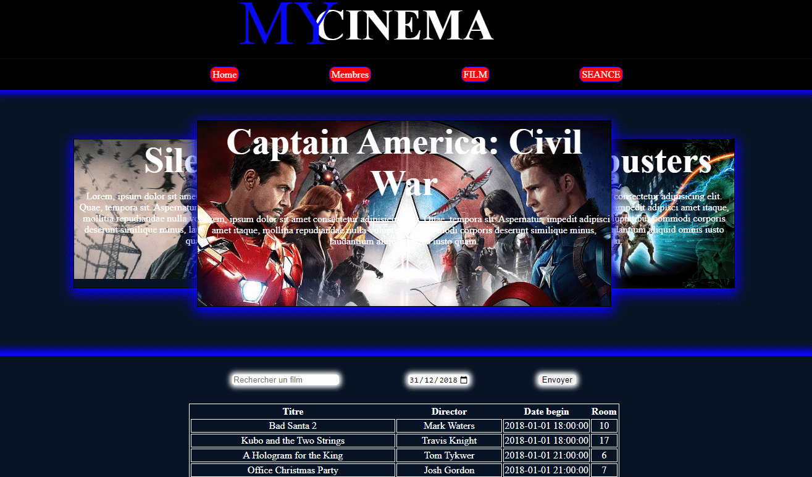

# :film_projector: PROJET MY CINEMA : PHP MySQL HTML CSS 🎬  

Ce projet est une site de référencement de films permettant de gérer un cinéma.  
Il a été développé en utilisant PHP, HTML, CSS et MySQL de manière native. 


Pour démarrer le projet :  
`Mettre le dépôt dans un serveur (apache)`  
```
link : http://127.0.0.1/MyCinema/index.php
```
`Insérer les données dans une base de données MySQL: `
```
CREATE DATABASE cinema;
USE cinema;
SOURCE /dossier/cinema.sql; || mysql -u root -p < C:\...\cinema.sql;
```
`Démarrer le serveur et aller a l'adresse de celui-ci (http://127.0.0.1/MyCinema/index.php)`
<p align="center">
    
</p>